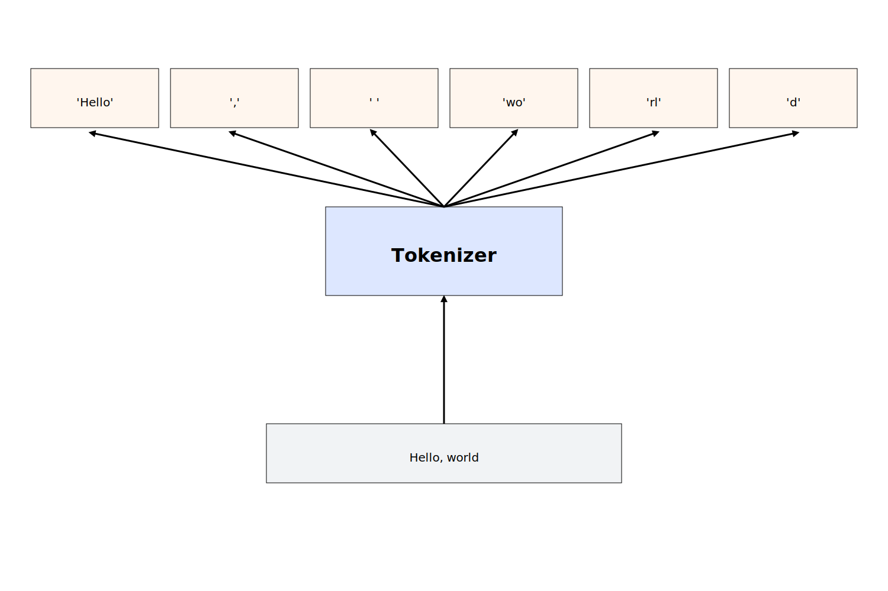

# Tokenization

## LLMs Generate Text by Generating Tokens

LLMs take text as input and produce text as output.
However, they don't process text the way we do—not as characters or words.
Instead, they work with more general units called **tokens**.

A **token** is the basic unit of text that an LLM can process.
Whenever you feed text into an LLM, it's first split into tokens.
Tokens can be single characters, whole words, or even subword fragments.

For example, the sentence "Hello, world" might be split into the tokens `'Hello'`, `','`, `' '`, `'wo'`, `'rl'`, `'d'`.
The token `'Hello'` is a single word, the tokens `'wo'` and `'rl'` are subword fragments, and the tokens `','` and `' '` are single characters.
All of these are valid tokens.



The set of all tokens available to an LLM is called the **vocabulary**.
Usually, the vocabulary of a modern LLM is very large, containing tens of thousands of tokens.

Now, here is the key point:
**LLMs generate text one token at a time.**

When you feed text into an LLM, it's first split into tokens.
The model then produces one token after another, each based on the input plus all previously generated tokens.
This continues until the model produces a special token called the **end-of-sequence token**, or reaches a predefined limit.

Consider the input text "How are you?".

The model first splits the text into tokens: `'How'`, `' '`, `'are'`, `' '`, `'you'`, `'?'`.

It then begins generating the tokens one by one.
The first token might be `'I'`, producing a new input text:
"How are you? I"

Next, it generates `' am'`, resulting in:
"How are you? I am"

Then comes `' fine'`:
"How are you? I am fine"

Followed by `'.'`:
"How are you? I am fine."

Finally, it may generate the special end-of-sequence token, signaling that it's done.

The final output text is "How are you? I am fine."
Usually, the end-of-sequence token is not included in the output text.

## The Tokenizer

The **tokenizer** is the LLM component that splits text into tokens and makes them digestible by the model.
Different LLMs use different tokenizers and not all of them split text the same way.
Tokenizers are usually trained on a large corpus of text and learn to split it in ways that are most useful for the model.

For example, the GPT models from OpenAI use a **byte-pair encoding (BPE)** tokenizer.
BPE starts with a vocabulary containing single characters and progressively merges the most frequent pairs of existing tokens to form new tokens.
The tokenizer might start with the vocabulary containing all the characters in the alphabet.
It might notice that `'t'` and `'h'` often appear together and merge them into `'th'`.
Later, it may merge `'th'` and `'e'` into `'the'`.
This continues until a certain number of tokens is reached.

> To get very technical, BPE works on bytes and not characters.
> This is especially important to keep in mind when you are working with non-English text or emojis.
> However, a full discussion of the details is beyond the scope of this book.

We can use the `tiktoken` library to see the tokens that a given LLM uses.

> If you don't want to go through the hassle of installing the library, you can also go to [this web demo](https://platform.openai.com/tokenizer) and paste your text there.

First, we need to install the library:

```bash
python -m pip install tiktoken
```

Then, we can use the library to get the tokens for a given model:

```python
import tiktoken

# Get the tokenizer for the GPT-4o model
enc = tiktoken.encoding_for_model("gpt-4o")

# Encode a string into tokens
tokens = enc.encode("Hello, world")
print(tokens) # [13225, 11, 2375]
```

Interestingly enough, the tokens printed by the `tiktoken` library are integers, not strings.
This is because LLMs are neural networks that operate on numbers instead of text.
Therefore, the tokenizer not only splits the text into tokens, but also assigns a unique integer to each token called a **token ID**.

For example, the `gpt-4o` tokenizer assigns the token ID 13225 to the token `'Hello'`, 11 to the token `','`, and 2375 to the token `' world'`.
Of course, different tokenizers may assign different token IDs to the same token.

We can decode each token back into a string using the `decode_single_token_bytes` method:

```python
decoded_text = enc.decode_single_token_bytes(13225)
print(decoded_text) # b'Hello'

decoded_text = enc.decode_single_token_bytes(11)
print(decoded_text) # b','

decoded_text = enc.decode_single_token_bytes(2375)
print(decoded_text) # b' world'
```

Notice that the last token isn't `'world'`, but `' world'`— with a leading space.
In fact, there are two different tokens for `'world'` and `' world'`:

```python
print(enc.encode("world")) # [24169]
print(enc.encode(" world")) # [2375]
```

This results from how BPE works: because it frequently merges tokens that appear together, and words often follow a space, many words end up with two versions—one with a leading space and one without.
This helps reduce token usage and improves the model's understanding of word boundaries.

Instead of decoding tokens one by one using the `decode_single_token_bytes` method, we can also decode the entire list of tokens at once using the `decode` method:

```python
decoded_text = enc.decode(tokens)
print(decoded_text) # 'Hello, world'
```

> Warning: While you can apply `decode` to single tokens, doing so may be lossy if the token does not align with UTF-8 character boundaries.

Remember how we said that the tokens are often subwords instead of whole words?
Here is an example of a tokenization where a single word is split into multiple tokens:

```python
tokens = enc.encode("Deoxyribonucleic acid")
print(tokens) # [1923, 1233, 3866, 53047, 68714, 291, 18655]
```

Let's print the tokens one by one:

```python
for token in tokens:
    print(enc.decode_single_token_bytes(token))
```

This will output:

```
b'De'
b'ox'
b'yr'
b'ibon'
b'ucle'
b'ic'
b' acid'
```

We can see that the word "Deoxyribonucleic" is split into 6 tokens.

## Token Pricing

Understanding tokens is key to understanding how LLMs are priced because model providers typically charge per token.
For example, the [OpenAI Pricing page](https://platform.openai.com/docs/pricing) lists prices per million tokens—not per request.

Let's say you want to use the `gpt-4o` model in your application and you want to estimate the cost of a given prompt.
The OpenAI pricing page gives two prices—one price for input tokens and one price for output tokens.
In this particular instance, they charge $2.50 per million input tokens and $10 per million output tokens as of the time of writing.

> Output tokens are more expensive than input tokens because they have to be generated by the model one by one.

Therefore, if you had a prompt containing 1000 tokens that is expected to generate 2000 tokens, the cost for the input tokens would be $2.50 \* 1000 / 1000000 = $0.0025 and the cost for the output tokens would be $10 \* 2000 / 1000000 = $0.02.

The total cost for the prompt would be $0.0025 + $0.02 = $0.0225.

This is a very simple example, but it already illustrates that your costs will be mostly determined by the number of output tokens that you generate.

That makes practical cost estimation a bit tricky because the number of output tokens is typically not known in advance.
Nevertheless, you can produce reasonable estimates by sending a few example requests and averaging the results.
You can either do this manually by counting the output tokens using the `tiktoken` library or by inspecting the response using the OpenAI API which gives you a `usage` object containing the number of input and output tokens:

```python
import os, requests

response = requests.post(
    "https://api.openai.com/v1/chat/completions",
    headers={
        "Authorization": f"Bearer {os.getenv('OPENAI_API_KEY')}",
        "Content-Type": "application/json",
    },
    json={
        "model": "gpt-4o",
        "messages": [
            {"role": "user", "content": "Hello, world"}
        ]
    }
)

response_json = response.json()
usage = response_json["usage"]
prompt_tokens = usage["prompt_tokens"]
completion_tokens = usage["completion_tokens"]
total_tokens = usage["total_tokens"]

print(f"Completion: {response_json['choices'][0]['message']['content']}")

print(f"Prompt tokens: {prompt_tokens}")
print(f"Completion tokens: {completion_tokens}")
print(f"Total tokens: {total_tokens}")
```

This will output something along the lines of:

```python
Completion: Hello! How can I assist you today?

Prompt tokens: 10
Completion tokens: 9
Total tokens: 19
```

OpenAI includes formatting tokens for message roles in the total token count—which is why you see 10 prompt tokens instead of just 4.
For most practical purposes, this difference will be negligible.

Once you've estimated how many tokens your application will use, it's a good idea to set a maximum token limit.
A common approach is to allow about 50% more than your estimate, using the `max_tokens` or `max_completion_tokens` parameter.
This helps avoid unexpected costs while giving you a bit of buffer.

## The Context Window

Every large language model has a **context window**—the maximum number of tokens that can be processed in a single request.
For example, the `gpt-4o` model has a context window of 128k tokens.

If you try to process more tokens than the context window allows, most APIs will throw an error while most chat interfaces will silently truncate the request.
This is especially important to keep in mind when you have long multi-turn conversations or are processing large files.

To avoid overflowing the context window, you can summarize or compress earlier content, truncate low-priority sections, use sliding windows or chunk long content into smaller pieces.
We will discuss some of these approaches in later chapters.

For now, it's important to understand that the context window is a hard limit on what you can process and that you need to keep that in mind when you design your application.
