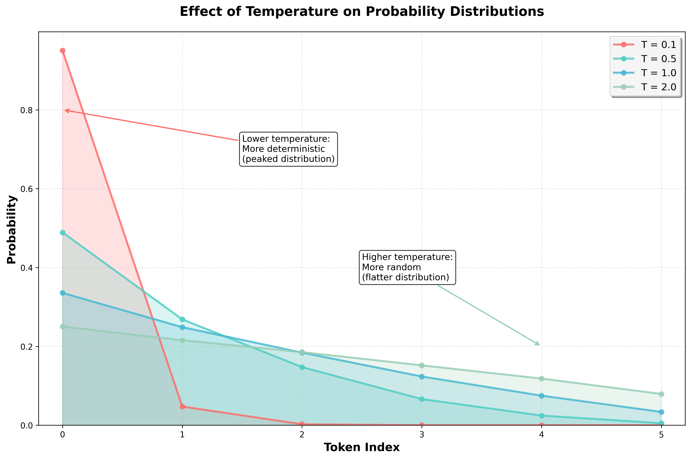

# Generating the Next Token

## A List of Probabilities

In the previous chapter, we have learned that LLMs generate text one token at a time.
So, how does the model decide which token to generate next?

Behind the scenes, the LLM produces a list of all possible next tokens, each paired with its probability.
For example, given the input "How are you? I am ", the model might produce a list like this:

- `fine` paired with probability 0.7
- `good` paired with probability 0.2
- `bad` paired with probability 0.1

Because the list includes every token in the model's vocabulary, it tends to be quite large.

Technically, the list contains **log probabilities**—that is, the logarithms of the actual probabilities.
This approach is more numerically stable than working with raw probabilities.
To convert a log probability back to a probability, you simply exponentiate it:

```python
import math

original_prob = 0.7
logprob = math.log(original_prob)
prob = math.exp(logprob)

print(f"Original probability: {original_prob}")
print(f"Log probability: {logprob}")
print(f"Reconstructed probability: {prob}")
```

This will output:

```
Original probability: 0.7
Log probability: -0.35667494393873245
Reconstructed probability: 0.7
```

The OpenAI API lets you retrieve the top log probabilities for the next token, given a prompt:

```python
import math
import os, requests

response = requests.post(
    "https://api.openai.com/v1/chat/completions",
    headers={
        "Authorization": f"Bearer {os.getenv('OPENAI_API_KEY')}",
        "Content-Type": "application/json",
    },
    json={
        "model": "gpt-4o",
        "messages": [
            {"role": "user", "content": "How are you?"}
        ],
        "logprobs": True,
        "top_logprobs": 5
    }
)

response_json = response.json()
logprobs = response_json["choices"][0]["logprobs"]
next_token_logprobs = logprobs["content"][0]["top_logprobs"]

for item in next_token_logprobs:
    token, logprob = item["token"], item["logprob"]
    prob = math.exp(logprob)
    print(token, prob)
```

This will output something along the lines of:

```
Thank 0.903825743563041
I'm 0.09526252257393902
I 0.0004998919591426934
Thanks 0.0003893162492314283
Hello 1.9382905474713714e-05
```

This means the model predicts `Thank` as the next token with a probability of 0.90, `I'm` with 0.09, and so on.

## Sampling from the List

Now that we have a list of probabilities, how do we use it to generate the next token?

The simplest approach is to use **greedy sampling**.
This simply means selecting the token with the highest probability:

```python
def greedy_sample(logprobs):
    return max(logprobs, key=lambda item: item["prob"])

next_token_logprobs = [
    {"token": "Apple", "prob": 0.6},
    {"token": "Banana", "prob": 0.3},
    {"token": "Cherry", "prob": 0.1},
]
print(greedy_sample(next_token_logprobs))
```

This will output:

```
{'token': 'Apple', 'prob': 0.6}
```

Another approach is to actually sample from the list.
This involves randomly selecting a token from the list, with each token weighted by its probability.
The higher the probability, the more likely the token will be selected.

```python
import random
from collections import defaultdict

def sample_from_list(logprobs):
    return random.choices(logprobs, weights=[item["prob"] for item in logprobs], k=1)[0]

next_token_logprobs = [
    {"token": "Apple", "prob": 0.6},
    {"token": "Banana", "prob": 0.3},
    {"token": "Cherry", "prob": 0.1},
]

counts = defaultdict(int)
for _ in range(1000):
    counts[sample_from_list(next_token_logprobs)["token"]] += 1

print(counts)
```

This will output something along the lines of:

```
{'Apple': 598, 'Banana': 303, 'Cherry': 99}
```

Note how the counts of every token are roughly proportional to their probabilities.

Greedy sampling has a few clear advantages: it's simple, fast, and fully deterministic.
Nevertheless, it comes with a downside: it always selects the most likely token—even when that token's probability is relatively low.
As a result, greedy sampling is often associated with repetitive output.

This concern was highlighted in the famous paper [The Curious Case of Neural Text Degeneration](https://arxiv.org/pdf/1904.09751) which shows that greedy sampling—and its close relative, beam search—often leads to repetitive text.
However, that study focused on GPT-2, a model that is outdated by today's standards.

More recent research paints a more nuanced picture.
For instance, [The Good, The Bad, and The Greedy: Evaluation of LLMs Should Not Ignore Non-Determinism](https://arxiv.org/pdf/2407.10457) found that greedy sampling actually outperformed more complex methods in some cases.
Similarly, [A Thorough Examination of Decoding Methods in the Era of LLMs](https://arxiv.org/pdf/2402.06925) argues that no single sampling method is the best—it all depends on the task at hand.
In practice, that does seem to hold true.

In short, while probabilistic sampling is typically the default, greedy sampling can be a reasonable—and at times even preferable—alternative.

The discussion around greedy sampling and probabilistic sampling highlights just how shaky the foundations of LLMs are and how quickly the field moves.
We still lack a definitive answer to something as basic as the best sampling method—let alone more complex questions.

## The Temperature Parameter

The temperature parameter plays a key role in probabilistic sampling.
It controls the randomness of the output: higher temperatures lead to more varied, random responses, while lower temperatures make the model behave more deterministically.

Conceptually, temperature reshapes the probability distribution from which we sample.
Instead of sampling directly from the raw probabilities generated by the model, we adjust them—either concentrating more heavily on high-probability tokens (low temperature) or flattening the distribution to give low-probability tokens a better chance (high temperature).

The actual formula looks like this:

$$
Q(x_i) = \frac{P(x_i)^\frac{1}{T}}{\sum_{j=1}^{n} P(x_j)^\frac{1}{T}}
$$

where:

- $P(x_i)$ is the raw probability of the token $x_i$ as produced by the model,
- $T$ is the temperature,
- $n$ is the total number of tokens and
- $Q(x_i)$ is the adjusted probability of the token $x_i$.

In Python, we can implement this as:

```python
def apply_temperature(probs, temperature):
    sum_denominator = sum(prob ** (1 / temperature) for prob in probs)
    return [prob ** (1 / temperature) / sum_denominator for prob in probs]
```

Before diving into the math, let's look at a simple example:

```python
def round_probs(probs):
    return [round(prob, 2) for prob in probs]

probs = [0.6, 0.3, 0.1]
print(round_probs(apply_temperature(probs, 0.1))) # [1.0, 0.0, 0.0]
print(round_probs(apply_temperature(probs, 0.5))) # [0.78, 0.2, 0.02]
print(round_probs(apply_temperature(probs, 1))) # [0.6, 0.3, 0.1]
print(round_probs(apply_temperature(probs, 2))) # [0.47, 0.33, 0.19]
```

Here's what we observe:

- A temperature of 1 leaves the probabilities unchanged.
- Temperatures below 1 make the distribution more peaked—concentrating on the most likely tokens.
- Temperatures above 1 make the distribution flatter—spreading out probability mass across more tokens.

Importantly, the relative ranking of tokens remains unchanged—only the probabilities are rescaled.

This makes sense when we look back at the formula.
For T = 1, we get:

$$
Q(x_i) = \frac{P(x_i)}{\sum_{j=1}^{n} P(x_j)} = P(x_i)
$$

Therefore, applying a temperature of T = 1 leaves the probabilities unchanged.

For T < 1, we get:

$$
Q(x_i) = \frac{P(x_i)^S}{\sum_{j=1}^{n} P(x_j)^S}
$$

where $S = \frac{1}{T} > 1$.

Therefore, each probability is raised to a power greater than 1.
This disproportionately suppresses lower-probability values.

For example, `0.9 ** 10` is approximately `0.35` while `0.1 ** 10` is approximately `1e-10` meaning that the smaller probability is effectively eliminated from the distribution.

The opposite is true for T > 1.
Here we get:

$$
Q(x_i) = \frac{P(x_i)^S}{\sum_{j=1}^{n} P(x_j)^S}
$$

where $S = \frac{1}{T} < 1$.

In this scenario, every probability will be raised to a power smaller than 1.
This boosts the lower values relative to the higher ones.

For example, `0.9 ** 0.1` is approximately `0.99` while `0.1 ** 0.1` is approximately `0.8` meaning that the smaller probability gets much more weight in the distribution than before.

With the math out of the way, here's the key takeaway:

- A temperature of 1 leaves the probabilities unchanged.
- A temperature smaller than 1 makes the probabilities more concentrated on the most likely tokens leading to more deterministic output.
- A temperature larger than 1 makes the probabilities more uniform leading to more random output.



In practice, we use log probabilities rather than raw probabilities, primarily for numerical stability.
So, instead of rescaling the probabilities, we rescale the log probabilities:

$$
Q(x_i) = \frac{P(x_i)^\frac{1}{T}}{\sum_{j=1}^{n} P(x_j)^\frac{1}{T}} = \frac{(\exp(\log(P(x_i)))^\frac{1}{T}}{\sum_{j=1}^{n} (\exp(\log(P(x_j)))^\frac{1}{T}}
$$

This is equivalent to:

$$
Q(x_i) = \frac{\exp(\frac{\log(P(x_i))}{T})}{\sum_{j=1}^{n} \exp(\frac{\log(P(x_j))}{T})}
$$

Letting $z_i = \log(P(x_i))$ we get:

$$
Q(x_i) = \frac{\exp(\frac{z_i}{T})}{\sum_{j=1}^{n} \exp(\frac{z_j}{T})}
$$

This is the formulation of the temperature parameter you will see most often in the literature.

We can implement this in Python as follows:

```python
def apply_temperature(logprobs, temperature):
    sum_denominator = sum(math.exp(logprob / temperature) for logprob in logprobs)
    return [math.exp(logprob / temperature) / sum_denominator for logprob in logprobs]
```

Let's use this function in a simple example:

```python
logprobs = [math.log(0.6), math.log(0.3), math.log(0.1)]
print(round_probs(apply_temperature(logprobs, 0.1))) # [1.0, 0.0, 0.0]
print(round_probs(apply_temperature(logprobs, 0.5))) # [0.78, 0.2, 0.02]
print(round_probs(apply_temperature(logprobs, 1))) # [0.6, 0.3, 0.1]
print(round_probs(apply_temperature(logprobs, 2))) # [0.47, 0.33, 0.19]
```

The results are the same as before.

So, how should you choose the optimal temperature?
Once again, it depends on the task—and there's little rigorous research on how to choose the “best” temperature.

Even OpenAI doesn't offer a definitive recommendation.
To quote from the [GPT-4 technical report](https://arxiv.org/pdf/2303.08774):

> Due to the longer iteration time of human expert grading, we did no methodology iteration on temperature or prompt, instead we simply ran these free response questions each only a single time at our best-guess temperature (0.6) and prompt.

As of the time of this writing, the OpenAI API defaults to a temperature of 1.
In actual applications, people often use values of 0.4 or 0.7, but this isn't really backed by any theory either.

Generally speaking, some people say that:

- lower temperatures (`T <= 0.7`) are suitable for tasks requiring precision and reliability, e.g. factual question answering
- moderate temperatures (`0.7 < T <= 1`) are suitable for general-purpose conversations where you need reliability but also some degree of creativity, e.g. for a chat bot
- higher temperatures (`T > 1`) are suitable for creative endeavors, e.g. for storytelling or brainstorming

Again, this has practically no rigorous theoretical basis and seems to just be something application developers have empirically converged on.
So take these values with a grain of salt—or rather, a full salt mill.
In real-world scenarios, you will have to experiment with different temperatures to find the one that works best for your task.

An interesting edge case is T = 0.
Technically, this is undefined because we divide by zero in the formula.
Usually, this edge case is treated as roughly equivalent to greedy sampling and models will try to pick the most likely token.
This aligns with the general intuition: lower temperatures yield more deterministic outputs.

> Note that the OpenAI API will not return fully deterministic results even for T = 0.
> The reasons for this are complicated and beyond the scope of this book.

## Top-K and Top-P Sampling

So far, we have covered greedy sampling and probabilistic sampling.

Greedy sampling is deterministic and always picks the most likely token.
Probabilistic sampling is non-deterministic and picks a token from the distribution potentially adjusted by the temperature parameter.

Sometimes, we want a middle ground: sampling probabilistically while constraining the selection to avoid low-quality tokens.

In **top-k sampling**, we consider only the top k most probable tokens and then sample from this restricted set:

```python
import random

def sample_top_k(probabilities, k):
    top_k_probabilities = sorted(probabilities, key=lambda item: item["prob"], reverse=True)[:k]
    return random.choices(top_k_probabilities, weights=[item["prob"] for item in top_k_probabilities], k=1)[0]
```

Let's use this function in a simple example:

```python
from collections import defaultdict

probabilities = [
    {"token": "Apple", "prob": 0.5},
    {"token": "Banana", "prob": 0.3},
    {"token": "Cherry", "prob": 0.1},
    {"token": "Durian", "prob": 0.05},
    {"token": "Elderberry", "prob": 0.05},
]

counts = defaultdict(int)
for _ in range(1000):
    counts[sample_top_k(probabilities, k=3)["token"]] += 1

print(counts)
```

This will output something like:

```
{'Cherry': 110, 'Banana': 312, 'Apple': 578}
```

Note that we only select from the top 3 tokens—everything else is ignored.

The parameter k is a hyperparameter that you can tune for your task.
The higher k is, the more diverse the output will be.

Top-k sampling is a simple and effective way to limit the tokens considered.
However, since k is fixed, it can be problematic: in some cases, the top k tokens may capture 99% of the probability mass, while in others, only 30%.

To address this, we can use **top-p sampling** (also known as nucleus sampling).

In top-p sampling, we include just enough tokens to capture a certain probability mass p.
We then sample from this set:

```python
import random

def sample_top_p(probabilities, p):
    sorted_probabilities = sorted(probabilities, key=lambda item: item["prob"], reverse=True)
    top_p_probabilities = []
    cumulative_prob = 0
    for item in sorted_probabilities:
        top_p_probabilities.append(item)
        cumulative_prob += item["prob"]
        if cumulative_prob >= p:
            break
    return random.choices(top_p_probabilities, weights=[item["prob"] for item in top_p_probabilities], k=1)[0]
```

Let's use this function in a simple example:

```python
logprobs = [
    {"token": "Apple", "prob": 0.5},
    {"token": "Banana", "prob": 0.3},
    {"token": "Cherry", "prob": 0.1},
    {"token": "Durian", "prob": 0.05},
    {"token": "Elderberry", "prob": 0.05},
]

counts = defaultdict(int)
for _ in range(1000):
    counts[sample_top_p(logprobs, p=0.9)["token"]] += 1

print(counts)
```

This will output something like:

```
{'Banana': 356, 'Apple': 531, 'Cherry': 113}
```

Note that we include only the top tokens whose cumulative probability meets or exceeds p.

As with k, p is a tunable hyperparameter.
The higher p is, the more diverse the output will be.

In practice, top-p sampling is often preferred over top-k because it's adaptive—it dynamically includes enough high-probability tokens to capture most of the probability mass.

You can specify the value of p using the `top_p` parameter in the OpenAI API:

```python
import os, requests

response = requests.post(
    "https://api.openai.com/v1/chat/completions",
    headers={
        "Authorization": f"Bearer {os.getenv('OPENAI_API_KEY')}",
        "Content-Type": "application/json",
    },
    json={
        "model": "gpt-4o",
        "messages": [
            {"role": "user", "content": "How are you?"}
        ],
        "top_p": 0.9
    }
)

response_json = response.json()
content = response_json["choices"][0]["message"]["content"]
print(content)
```

It is generally recommended to specify either the `temperature` or the `top_p` parameter, but not both.
