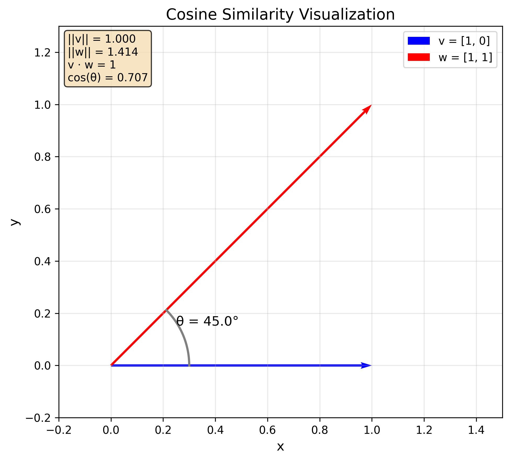
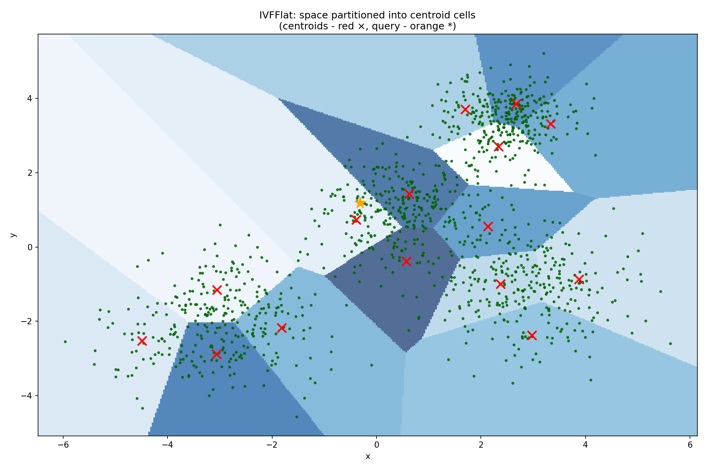
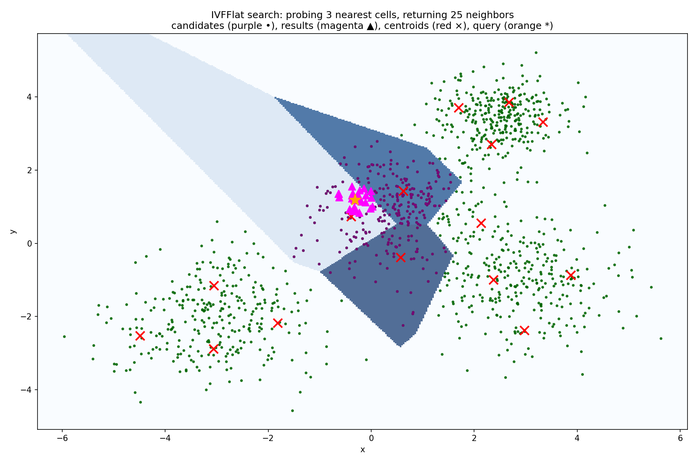

# Embeddings

## What are Embeddings?

Embeddings are a way to represent text as a semantically meaningful vector of numbers.
The core idea is that if two texts are similar, then their vector representations should be similar as well.

For example, the embeddings of "I love programming in Python" and "I like coding in a language whose symbol is a snake" should be similar despite the fact that the texts have practically no words in common.
This is called **semantic similarity** as opposed to syntactic similarity which is about the similarity of the sentence structure and the words used.

Depending on the use case, you can embed words, sentences, paragraphs, or even entire documents.

The concept of embeddings—and their similarities—is useful for many applications:

- **Semantic search**: You can use embeddings to find the most similar texts to a given query
- **Clustering**: You can use embeddings to cluster texts into different groups based on their semantic similarity
- **Recommendation systems**: You can use embeddings to recommend similar items to a given item

In later chapters, we'll also explore how to use embeddings to build RAG pipelines that enhance the quality of your LLM applications.

So how are embeddings generated?
Interestingly, large language models (LLMs) can produce them as a byproduct of their architecture.

After the tokenizer has converted the text into tokens, a so-called embedding layer transforms every token into a high-dimensional vector.
These vectors are continuously refined through the transformer layers until an "unembedding layer" produces the final output—the logits over the vocabulary.
Since an LLM is trained to predict the next token, its embedding layer automatically learns to represent tokens in a semantically meaningful way.

Alternatively, you can use specialized embedding models trained specifically to produce high-quality embeddings.

OpenAI provides a range of embedding models, the most important of which are the `text-embedding-3-small` and `text-embedding-3-large` models.
You can use them like this:

```python
import os, requests

response = requests.post(
    "https://api.openai.com/v1/embeddings",
    headers={
        "Authorization": f"Bearer {os.getenv('OPENAI_API_KEY')}",
        "Content-Type": "application/json",
    },
    json={
        "input": "Your text string goes here",
        "model": "text-embedding-3-small"
    }
)

response_json = response.json()
embedding = response_json["data"][0]["embedding"]
print(embedding[:5])
print(len(embedding))
```

This will output something along the lines of:

```
[0.005132983, 0.017242905, -0.018698474, -0.018558515, -0.047250036]
1536
```

Note that embeddings are typically high-dimensional.
For example, the `text-embedding-3-small` model produces 1536-dimensional embeddings while the `text-embedding-3-large` model produces 3072-dimensional embeddings.

In general, higher-dimensional embeddings capture more nuanced relationships but can be slower to compute and more memory-intensive to store.

## Embedding Similarity

Remember, the core idea behind embeddings is that semantically similar texts should have similar vector representations.
But how can we actually calculate the similarity between two embeddings?

Embeddings are vectors, and vector similarity is commonly measured using **cosine similarity**, defined as:

$$
\text{similarity}(\vec{v}, \vec{w}) = \cos(\theta) = \frac{\vec{v} \cdot \vec{w}}{\|\vec{v}\| \|\vec{w}\|}
$$

where \\(\theta\\) is the angle between the vectors \\(\vec{v}\\) and \\(\vec{w}\\), \\(\vec{v} \cdot \vec{w}\\) is the dot product of the vectors and \\(\|\vec{v}\|\\) and \\(\|\vec{w}\|\\) are their norms.

As a reminder, the dot product (also called the inner product) of two vectors is defined as:

$$
\vec{v} \cdot \vec{w} = \sum_{i=1}^{n} v_i w_i
$$

And the norm of a vector is defined as:

$$
\|\vec{v}\| = \sqrt{\sum_{i=1}^{n} v_i^2}
$$

The cosine similarity is:

- equal to 1 if the vectors have the same direction,
- equal to 0 if the vectors are orthogonal,
- equal to -1 if the vectors have opposite directions.

Generally speaking, the closer the cosine similarity is to 1, the more similar the vectors are.
The closer it is to -1, the more dissimilar they are.

Here is an example implementation of cosine similarity:

```python
def get_norm(v):
  return math.sqrt(sum(x ** 2 for x in v))

def get_dot_product(v, w):
  return sum(v[i] * w[i] for i in range(len(v)))

def get_cosine_similarity(v, w):
  return get_dot_product(v, w) / (get_norm(v) * get_norm(w))

v = [1, 0]
w = [1, 1]

print(get_norm(v)) # 1.0
print(get_norm(w)) # 1.41...
print(get_dot_product(v, w)) # 1
print(get_cosine_similarity(v, w)) # 0.707...
```

This is how the cosine similarity between the two vectors looks like:



Note that you typically shouldn't use plain Python implementations for mathematical operations like norms or dot products.
Instead, rely on libraries like NumPy or SciPy because the latter will **vectorize** the operations which is much more efficient than using regular Python loops.

Developers often use the dot product—or even Euclidean distance—to measure similarity instead of the cosine similarity.
This works because embeddings are usually normalized to unit length.

Let's verify that this is true for the embeddings produced by OpenAI:

```python
import math

def get_norm(embedding):
    return math.sqrt(sum(x ** 2 for x in embedding))

# Here embedding is some embedding from OpenAI (for example, you can use the embedding from the previous section)
print(get_norm(embedding)) # 1.0
```

If two embeddings are normalized to unit length—that is, their norms are 1—their cosine similarity is equal to their dot product:

$$
\cos(\theta) = \frac{\vec{v} \cdot \vec{w}}{\|\vec{v}\| \|\vec{w}\|} = \vec{v} \cdot \vec{w}
$$

Similarly, the Euclidean distance of two unit-length vectors becomes a monotonic transformation of the cosine similarity:

$$
\|\vec{v} - \vec{w}\|^2 = \|\vec{v}\|^2 + \|\vec{w}\|^2 - 2 \vec{v} \cdot \vec{w} = 2 - 2 \cos(\theta)
$$

Therefore:

$$
\|\vec{v} - \vec{w}\| = \sqrt{2 - 2 \cos(\theta)}
$$

This means that for unit-length embeddings, ranking by cosine similarity is equivalent to ranking by dot product or Euclidean distance.
However, this equivalence holds only for unit-length vectors.

Therefore, when using similarities other than the cosine similarity, you should always verify that the embeddings produced by the embedding model you are using are normalized to unit length.

## Vector Databases

Vector databases provide an efficient way to store and retrieve embeddings, with their primary purpose being to enable fast similarity searches.
When working with a large number of embeddings, we would theoretically have to compare a query embedding to all others to find the nearest neighbors.
This process becomes increasingly slow as the number of embeddings grows.
To address this, vector databases use specialized algorithms to accelerate the search process.

One of the most widely used algorithms for efficient similarity search is **IVFFlat** (short for InVerted File Flat).

The IVFFlat algorithm works by partitioning the embedding space into cells with centroids.
At search time, the algorithm first finds the nearest centroids and then performs a search only inside those cells.



In other words, the algorithm performs the following steps to find the best embeddings for a query embedding \\(\vec{v}\\):

1. Calculate the distance between \\(\vec{v}\\) and all centroids.
2. Find the \\(k\\) centroids with the smallest distance to \\(\vec{v}\\).
3. Calculate the distance between \\(\vec{v}\\) and all embeddings within the cells corresponding to the \\(k\\) centroids from step 2.
4. Return the embeddings with the smallest distance to \\(\vec{v}\\).



The cells and their centroids must be learned from the data in advance, which is why we typically build the index only after inserting some initial data.

It's important to note that, like most similarity search algorithms used in vector databases, IVFFlat performs only an **approximate nearest neighbor search**.
As a result, it may not always return the exact nearest neighbors, depending on the location of the query embedding in the vector space.
This trade-off prioritizes performance over absolute accuracy.

We commonly use the `pgvector` extension for Postgres to store the embeddings.
Let's explore how to use it.

First, start a local PostgreSQL database:

```bash
docker run -d --name pgvector-db \
  -e POSTGRES_USER=postgres \
  -e POSTGRES_PASSWORD=Secret123!      \
  -e POSTGRES_DB=vectordb              \
  -p 5432:5432                         \
  -v pgdata:/var/lib/postgresql/data   \
  pgvector/pgvector:pg17
```

Connect to the database:

```bash
docker exec -it pgvector-db psql -U postgres -d vectordb
```

Check whether the `vector` extension is enabled:

```sql
SELECT extname, extversion
FROM   pg_extension
WHERE  extname = 'vector';
```

If the extension is not enabled, enable it:

```sql
CREATE EXTENSION vector;
```

Let's now create a table to store the embeddings:

```sql
CREATE TABLE items (
  id        SERIAL PRIMARY KEY,
  content   TEXT,
  embedding VECTOR(3)
);
```

> In reality, the embedding dimension should be much larger: we only use 3 because this is a toy example.

Insert some data into the table:

```sql
INSERT INTO items (content, embedding) VALUES
  ('apple',  '[0.1,0.2,0.3]'),
  ('banana', '[0.11,0.19,0.29]'),
  ('car',    '[0.9,0.8,0.7]');
```

Double-check that the data was inserted correctly:

```sql
SELECT * FROM items;
```

Now we can run our first similarity search:

```sql
SELECT id, content, embedding <-> '[0.1,0.2,0.25]' AS dist
FROM items
ORDER BY dist
LIMIT 2;
```

This returns the embeddings for `banana` and `apple`, which are the two closest to `[0.1,0.2,0.25]`.

It's important to note that `pgvector` technically works with distances and not with similarities.
The difference is straightforward: the larger the distance, the smaller the similarity, and vice versa.
After all, two vectors with high similarity should be close together, while those with low similarity should be far apart.

In fact, it may be more intuitive to think in terms of distance rather than similarity. While the concept of "similarity" between vectors can be somewhat abstract, distance is a straightforward geometric measure that is immediately understandable.

The `pgvector` extension supports three operators for computing distance:

- `<->` for the Euclidean distance
- `<#>` for the negative inner product
- `<=>` for the cosine distance which is defined as `1 - cosine similarity`

Note that `<#>` is the negative inner product because `<#>` is supposed to be a distance operator.
Similarly, `<=>` represents the cosine distance, not the cosine similarity.

We can use the operators like this:

```sql
SELECT
  '[0.1,0.2,0.3]'::vector <-> '[0, 0.1, 0.2]'::vector  AS euclidean_distance,
  '[0.1,0.2,0.3]'::vector <#> '[0, 0.1, 0.2]'::vector  AS neg_inner_product,
  '[0.1,0.2,0.3]'::vector <=> '[0, 0.1, 0.2]'::vector  AS cosine_distance;
```

This will output approximately:

- `0.1732` for the Euclidean distance
- `-0.0800` for the negative inner product
- `0.0438` for the cosine distance

We can verify our results in Python:

```python
import math

def get_distance(v, w):
  return math.sqrt(sum((v[i] - w[i]) ** 2 for i in range(len(v))))

def get_dot_product(v, w):
  return sum(v[i] * w[i] for i in range(len(v)))

def get_norm(v):
  return math.sqrt(sum(x ** 2 for x in v))

def get_cosine_similarity(v, w):
  return get_dot_product(v, w) / (get_norm(v) * get_norm(w))

v = [0.1, 0.2, 0.3]
w = [0, 0.1, 0.2]

print("Euclidean distance:", get_distance(v, w))
print("Negative inner product:", -get_dot_product(v, w))
print("Cosine distance:", 1 - get_cosine_similarity(v, w))
```

This will output approximately:

- `0.1732` for the Euclidean distance
- `-0.0800` for the negative inner product
- `0.0438` for the cosine distance

These values match those returned by `pgvector`.

If all vector databases did was compute distances, implementing one would be relatively straightforward.
However, remember that their primary purpose is to support efficient distance-based search.

We won't see meaningful performance gains with just three items.
So, let's drop the current table, create a new one, and insert a million random 512-dimensional embeddings along with some dummy content.

```sql
DROP TABLE items;

CREATE TABLE items (
  id        SERIAL PRIMARY KEY,
  content   TEXT,
  embedding VECTOR(512)
);

INSERT INTO items (content, embedding)
SELECT
  'rand-' || g,
  ARRAY(
    SELECT random()
    FROM generate_series(1, 512)
  )::vector(512)
FROM generate_series(1, 1000000) AS g;
```

> This command will take a while to complete.

We should double check that the data was inserted correctly by looking at the first 10 rows and the total number of rows:

```sql
SELECT * FROM items LIMIT 10;
SELECT COUNT(*) FROM items;
```

Let's perform a simple similarity search and find the 5 nearest neighbors of the zero vector:

```sql
WITH q AS (
  SELECT array_fill(0.0::float8, ARRAY[512])::vector(512) AS v
)
SELECT id, content
FROM   items, q
ORDER  BY embedding <=> q.v
LIMIT  5;
```

This takes roughly 2.7 seconds on my machine—your results may vary.

If we explain the query by prefixing it with `EXPLAIN ANALYZE`, we can see that the query is performing a sequential scan of the table:

```
Sort Method: top-N heapsort [...]
    ->  Nested Loop [...]
        ->  CTE Scan on q [...]
        ->  Seq Scan on items [...]
```

We can now add an IVFFlat index to the table.
When creating the index, we can specify two parameters—`lists` which determines the number of cells to use and `probes` which determines the number of nearest cells to consider:

```sql
CREATE INDEX ON items USING ivfflat (embedding vector_cosine_ops) WITH (lists = 200);
SET ivfflat.probes = 100;
```

This command will take a while because it has the build the index from scratch—the cells and their centroids have to be learned from the data.

Now, let's run a similarity search again:

```sql
WITH q AS (
  SELECT array_fill(0.0::float8, ARRAY[512])::vector(512) AS v
)
SELECT id, content
FROM   items, q
ORDER  BY embedding <=> q.v
LIMIT  5;
```

This takes roughly 0.7 seconds on my machine—yours may be different.
This is a significant improvement in query performance and this improvement will only become more pronounced as the number of embeddings grows.

If we explain the query by prefixing it with `EXPLAIN ANALYZE`, we can see that the query is now using the IVFFlat index:

```
->  Index Scan using items_embedding_idx on items
```

You can drop the index again by running:

```sql
DROP INDEX items_embedding_idx;
```

Try rebuilding the index with different values for `lists` and `probes` and see how the performance changes.

There are other indices that you can use for similarity search.
For example, `pgvector` also supports the HNSW (Hierarchical Navigable Small World) index.
Additionally, other vector databases like Faiss support even more sophisticated indices.

For most practical purposes, `pgvector` combined with the IVFFlat index is sufficient.
Nevertheless, we encourage you to explore other vector databases and indices to find the best fit for your use case.
After all, the core idea behind all vector databases is the same: they enable us to store embeddings and perform efficient similarity searches using specialized indices.

## Hybrid Search and Rank Fusion

The problem with a pure embedding search is that we are not guaranteed to find potentially important exact matches.

For example, consider a customer support ticket containing an identifier such as "TS-01".
An embedding search might miss this exact match because embeddings are high-dimensional vectors whose results are difficult to interpret and do not guarantee the retrieval of critical terms.
Therefore, in such a case it would be useful to combine the results of a semantic search with those of a traditional keyword search.

Before we cover traditional keyword search, we will first need to introduce a concept called **inverse document frequency**, or IDF, which measures how specific a keyword is in a document collection.
The core idea behind IDF is that the specificity of a keyword is inversely proportional to the number of documents that contain it:

$$
\text{IDF}(q) = \log \left(\frac{N - n(q) + 0.5}{n(q) + 0.5} + 1\right)
$$

where \\(N\\) is the total number of documents in the collection and \\(n(q)\\) is the number of documents that contain the keyword \\(q\\).

Here is how we can implement this in Python:

```python
import math

def get_idf(keyword, documents):
    N = len(documents)
    n_q = sum(1 for doc in documents if keyword in doc)

    idf = math.log((N - n_q + 0.5) / (n_q + 0.5) + 1)
    return idf

idf_i = get_idf("i", documents)
print(idf_i) # 0.24...

idf_password = get_idf("password", documents)
print(idf_password) # 0.69...

idf_ts01 = get_idf("TS-01", documents)
print(idf_ts01) # 1.54...
```

We can see that rare words like "TS-01" or "password" have a higher IDF score than more common words like "I".

Technically, the IDF score measures specificity, not importance.
After all, just because a word is rare doesn't necessarily mean it's important.
However, IDF is often used in algorithms that estimate word importance, because it increases the weight of rare terms—a common goal when building search engines.

Now, we can turn to the main topic of this section: exact match search, which we will implement using the BM25 algorithm.

Let's consider the following document collection:

```python
documents = [
    "TS-01 Can't access my account with my password",
    "TS-02 My password is not working and I don't know what it is so I need help",
    "TS-03 I need help with my account and I can't log in",
    "TS-04 I am having trouble with my setup and I don't know what it is",
    "TS-05 I can't access my account with my password",
    "TS-06 I need help",
]
documents = [doc.split() for doc in documents]
```

The core idea of BM25 is that the relevance of a document to a query depends on the frequency of the query terms in the document.

Consider a query \\(q\\) containing the keywords \\(q_1, q_2, \ldots, q_n\\) and a document \\(d\\).
The score of the document \\(d\\) for the query \\(q\\) is given by:

$$
\text{score}(q, d) = \sum_{i=1}^{n} \text{score}(q_i, d)
$$

How can we compute the score for a single keyword \\(q_i\\)?

We want the following properties from a good scoring function:

1. Rare words matter more. We want the score to be proportional to the inverse document frequency of the keyword.
2. The more often the keyword appears in the document, the more relevant it is. We want the score to be proportional to the term frequency of the keyword in the document.
3. Longer documents should dilute relevance. We want the score to be inversely proportional to the document length.

Here is what a first attempt at the score for a single keyword \\(q_i\\) might look like:

$$
\text{score}(q_i, d) = \text{IDF}(q_i) \cdot \frac{1}{1 + \frac{|d|}{f(q_i, d)}} = \text{IDF}(q_i) \cdot \frac{f(q_i, d)}{f(q_i, d) + |d|}
$$

where \\(f(q_i, d)\\) is the frequency of the keyword \\(q_i\\) in the document \\(d\\) and \\(|d|\\) is the length of the document.

It turns out that, in practice, this is not a good scoring function.
We need to stabilize it to avoid over-penalizing longer documents or over-rewarding repeated words.
A full derivation of the BM25 scoring function is beyond the scope of this book, so we will simply present the final formula:

$$
\text{score}(q_i, d) = \text{IDF}(q_i) \cdot \frac{f(q_i, d) \cdot (k_1 + 1)}{f(q_i, d) + k_1 \cdot (1 - b + b \cdot \frac{|d|}{avgdl})}
$$

Here \\(k_1\\) and \\(b\\) are parameters that we can tune, typically setting them to \\(1.2 < k_1 < 2.0\\) and \\(0.75 < b < 1.0\\).
Additionally, \\(avgdl\\) is the average document length in the document collection.

Let's implement this in Python:

```python
def get_bm25(query_keywords, document, documents, k1=1.5, b=0.75):
    avgdl = sum(len(doc) for doc in documents) / len(documents)

    doc_len = len(document)

    score = 0
    for keyword in query_keywords:
        f_qi_d = document.count(keyword)

        if f_qi_d == 0:
            continue

        idf = get_idf(keyword, documents)

        keyword_score = idf * (f_qi_d * (k1 + 1)) / (f_qi_d + k1 * (1 - b + b * (doc_len / avgdl)))
        score += keyword_score

    return score
```

Now we can test the implementation using an example query:

```python
query = ["TS-01", "I", "password"]
for i, doc in enumerate(documents):
    score = get_bm25(query, doc, documents)
    print(f"Document {i+1} BM25 score: {round(score, 2)}")
```

This will output:

```
Document 1 BM25 score: 2.53
Document 2 BM25 score: 0.84
Document 3 BM25 score: 0.33
Document 4 BM25 score: 0.31
Document 5 BM25 score: 1.01
Document 6 BM25 score: 0.34
```

The first document has by far the highest score which is exactly what we would expect thanks to the presence of the keyword "TS-01".
Note that it doesn't matter that the keyword "I" is absent from this document and present in the other documents because "I" is such a common word that its IDF is close to 0.
However, the presence of "TS-01" matters a great deal because it is a highly specific keyword and we value it accordingly.

In practice, we must convert every document and query into a list of keywords.
In this example, we simply split the documents and the query into individual words.
For real-world applications, however, we would use a more sophisticated method, such as removing stop words and applying stemming or lemmatization.

Now that we have an additional way to score documents by considering exact matches, we need to meaningfully combine the results of the semantic search and the keyword search.

Theoretically, we could take the union of the semantic search results and the keyword search results.
However, this approach would either return an excessively large set of documents or discard too many.
Ranking the documents by relevance is therefore essential, and this is straightforward when working with a single search type.

For example, for the semantic search, we can use the cosine similarity to rank the documents.
For the keyword search, we can use the BM25 score.
But how can we rank documents that we have retrieved from two or more search types?
This is where **rank fusion** comes in.

The simplest rank fusion technique is **reciprocal rank fusion**.
For each retriever, we compute the reciprocal of the rank of the document plus a constant and sum the results.
The smaller the ranks, the higher the final score will be:

$$
\text{score}(d) = \sum_{r \in \text{retrievers}} \frac{1}{k + \text{rank}_r(d)}
$$

where \\(k\\) is a constant (typically \\(k = 60\\)) and \\(\text{rank}\_r(d)\\) is the rank of the document \\(d\\) for the retriever \\(r\\).

Let's implement this in Python:

```python
def rrf(first_results, second_results, k=60):
    all_docs = set(doc_id for doc_id, _ in first_results) | set(doc_id for doc_id, _ in second_results)

    first_ranks = {doc_id: rank + 1 for rank, (doc_id, _) in enumerate(first_results)}
    second_ranks = {doc_id: rank + 1 for rank, (doc_id, _) in enumerate(second_results)}

    rrf_scores = []
    for doc_id in all_docs:
        score = 0

        if doc_id in first_ranks:
            score += 1 / (k + first_ranks[doc_id])

        if doc_id in second_ranks:
            score += 1 / (k + second_ranks[doc_id])

        rrf_scores.append((doc_id, score))

    rrf_scores.sort(key=lambda x: x[1], reverse=True)
    return rrf_scores
```

Let's test this with an example:

```python
semantic_results = [
    ("doc1", 0.95),
    ("doc3", 0.87),
    ("doc5", 0.82),
    ("doc2", 0.78),
    ("doc4", 0.65)
]

bm25_results = [
    ("doc2", 2.53),
    ("doc1", 1.84),
    ("doc4", 1.12),
    ("doc6", 0.95),
    ("doc3", 0.71)
]

fused_results = rrf(semantic_results, bm25_results)

for rank, (doc_id, score) in enumerate(fused_results, 1):
    print(f"{rank}. {doc_id}: {round(score, 4)}")
```

This will output:

```
1. doc1: 0.0325
2. doc2: 0.032
3. doc3: 0.0315
4. doc4: 0.0313
5. doc5: 0.0159
6. doc6: 0.0156
```

We can see that the ranks of the documents depend on both the semantic search and the keyword search.

Rank fusion also works if you have more than two search types and is commonly used for balancing different search demands.
