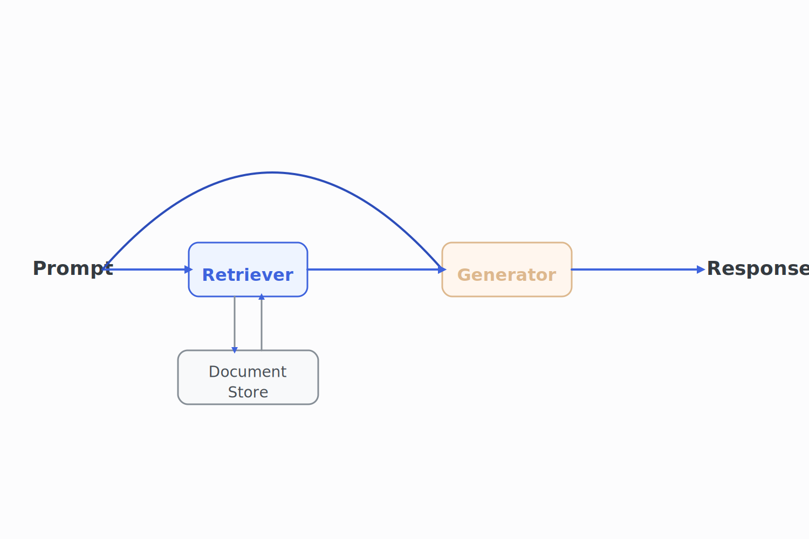

# Retrieval Augmented Generation

## The RAG Architecture

In the first chapter, we have discussed a few problems LLMs have with hallucinations.
One way to address this is to use a technique called **retrieval-augmented generation** (RAG).

The idea is straightforward: rather than directly generating a response, we first retrieve relevant information from a knowledge base and then use it to construct the response.
Such an approach is especially useful if we are working with domain-specific data that regular Large Language Models (LLMs) are not trained on.

The simplest way to implement this is to find the most relevant pieces of information in a knowledge base by performing an embedding-based similarity search.
Then, we add those documents to the prompt and generate a response.

Let's look at a simple example.
Consider the following documents about a fictitious company called "Example Corp" along with a few other pieces of information:

```python
documents = [
    "Example Corp was founded in 2020",
    "The capital of France is Paris",
    "Example Corp is a technology company that develops AI solutions",
    "The capital of Germany is Berlin",
    "Example Corp is headquartered in San Francisco",
    "The capital of Spain is Madrid",
    "The CEO of Example Corp is John Doe",
    "The capital of Italy is Rome",
]
```

Now, let's say that the user would like to know something about Example Corp:

```python
user_query = "Who is the CEO of Example Corp?"
```

To answer this question, we first need to retrieve the most relevant documents from the knowledge base.
We can do this by embedding the user query and the documents and then performing a similarity search.

We already know how to generate an embedding for a string:

```python
import os, requests

def generate_embedding(text):
    response = requests.post(
        "https://api.openai.com/v1/embeddings",
        headers={
            "Authorization": f"Bearer {os.getenv('OPENAI_API_KEY')}",
            "Content-Type": "application/json",
        },
        json={
            "input": text,
            "model": "text-embedding-3-small"
        }
    )

    response_json = response.json()
    embedding = response_json["data"][0]["embedding"]
    return embedding
```

Now, we can embed the documents and the user query:

```python
document_embeddings = [generate_embedding(doc) for doc in documents]
user_query_embedding = generate_embedding(user_query)
```

We can now perform a similarity search to find the most relevant documents.
Since OpenAI embeddings are normalized, we can use the dot product to compute the similarity between the query embedding and the document embeddings.
Then, it's just a matter of picking the top K documents with the highest similarity to the query:

```python
def get_dot_product(v, w):
    return sum(v_i * w_i for v_i, w_i in zip(v, w))

def get_most_similar_documents(query_embedding, document_embeddings, top_k=5):
    similarities = [get_dot_product(query_embedding, doc_embedding) for doc_embedding in document_embeddings]
    most_similar_indices = sorted(range(len(similarities)), key=lambda i: similarities[i], reverse=True)[:top_k]
    return [(documents[i], similarities[i]) for i in most_similar_indices]
```

Now, we can use this function to retrieve the most relevant documents:

```python
most_similar_documents = get_most_similar_documents(user_query_embedding, document_embeddings)
for doc, similarity in most_similar_documents:
    print(f"Document: {doc}, Similarity: {round(similarity, 2)}")
```

This outputs the following:

```python
Document: The CEO of Example Corp is John Doe, Similarity: 0.86
Document: Example Corp was founded in 2020, Similarity: 0.5
Document: Example Corp is headquartered in San Francisco, Similarity: 0.5
Document: Example Corp is a technology company that develops AI solutions, Similarity: 0.47
Document: The capital of France is Paris, Similarity: 0.06
```

The document with the highest similarity is the one that contains the exact information we are looking for—the CEO of Example Corp.
These are followed by three documents that contain general information about Example Corp, though not the specific detail we're looking for. While still relevant, their similarity scores are noticeably lower.
The last document contains information about France which is completely irrelevant to our query and the similarity is close to 0.

Now, we can use these documents to generate a response.
We do this by constructing a prompt that includes the user query and the most relevant documents:

```python
def generate_response(user_query, most_similar_documents):
    prompt = f"""
    Answer the user query based on the following documents:
    {"\n".join(most_similar_documents)}

    User query: {user_query}
    """

    response = requests.post(
        "https://api.openai.com/v1/chat/completions",
        headers={
            "Authorization": f"Bearer {os.getenv('OPENAI_API_KEY')}",
            "Content-Type": "application/json",
        },
        json={
            "model": "gpt-4o",
            "messages": [{"role": "user", "content": prompt}],
        },
    )

    response_json = response.json()
    return response_json["choices"][0]["message"]["content"]
```

Let's now use this function to actually generate a response:

```python
response = generate_response(user_query, [doc[0] for doc in most_similar_documents])
print(response)
```

This will return something along the lines of:

```
The CEO of Example Corp is John Doe.
```

This is the correct answer.

To recap, RAG consists of two steps:

1. **Retrieval**—Find the most relevant documents in a knowledge base.
2. **Generation**—Use the retrieved documents to generate a response.



While the core concept behind RAG is relatively simple, applying it in real-world scenarios introduces additional complexity.
In particular, we often work with large documents that must be broken into smaller segments, or **chunks**, to make them suitable for retrieval.

## Simple Chunking Strategies

Consider the following document:

```python
document = """
John Doe is the CEO of ExampleCorp.
He's a skilled software engineer with a focus on scalable systems.
In his spare time, he plays guitar and reads science fiction.

ExampleCorp was founded in 2020 and is based in San Francisco.
It builds AI solutions for various industries.
John still finds time for music and books, even with a busy schedule.

The company is a subsidiary of Example Inc, a tech conglomerate.
Example Inc started in 2015 and is headquartered in New York.
ExampleCorp keeps its startup energy despite the parent company.

San Francisco and New York serve as the main hubs.
This supports talent on both coasts.
John's mix of tech and creativity shapes a forward-thinking culture.
"""
```

How could we split this document into digestible chunks?

The simplest way to chunk a document is to use **fixed-size chunking**.
This method is relatively simple: we split the document into chunks of a fixed size.

Here is how the implementation looks like:

```python
def fixed_size_chunking(document, chunk_size):
    return [document[i:i+chunk_size] for i in range(0, len(document), chunk_size)]

chunks = fixed_size_chunking(document, 100)
for chunk in chunks[:3]:
    print(repr(chunk))
```

The issue with this approach is that it will split the document at arbitrary points.
For example, here are the first three chunks of our example document:

```
"\nJohn Doe is the CEO of ExampleCorp.\nHe's a skilled software engineer with a focus on scalable syste"
'ms.\nIn his spare time, he plays guitar and reads science fiction.\n\nExampleCorp was founded in 2020 a'
'nd is based in San Francisco.\nIt builds AI solutions for various industries.\nJohn still finds time f'
```

Note how the word "systems" is split between the first and second chunk.
With longer documents, this will become a big problem as we will split context between chunks and lose important information.

A straightforward improvement to fixed-size chunking is **sliding window chunking** where each new chunk slides forward while retaining some overlap with the previous chunk.
This allows us to retain some context between the chunks.

```python
def sliding_window_chunking(document, chunk_size, overlap):
    chunks = []
    for i in range(0, len(document), chunk_size - overlap):
        chunks.append(document[i:i+chunk_size])
    return chunks

chunks = sliding_window_chunking(document, 100, 20)
for chunk in chunks[:3]:
    print(repr(chunk))
```

Here are the first three chunks:

```
"\nJohn Doe is the CEO of ExampleCorp.\nHe's a skilled software engineer with a focus on scalable syste"
'us on scalable systems.\nIn his spare time, he plays guitar and reads science fiction.\n\nExampleCorp w'
'tion.\n\nExampleCorp was founded in 2020 and is based in San Francisco.\nIt builds AI solutions for var'
```

This is slightly better, but still not great.

The problem with both of these approaches is that they are not aware of the content of the document.
They will always split the document at the same place regardless of the actual document structure.

A more sophisticated approach is to use**recursive chunking** where we define a hierarchy of separators and use them to recursively split the document into smaller chunks.
For instance, we might prioritize separators in the following order:

- Paragraphs (split by `\n\n`)
- Sentences (split by `.`)
- Sentence parts (split by `,`)

We can then use this hierarchy to recursively split the document into smaller chunks where we first split by the coarsest separator and then move to the finer ones until the chunks are below a certain size.

Here is how the function signature would look like:

```python
def recursive_chunking(text, separators, max_len):
    ...
```

How could we implement this?
First, we would need to define the base case—if the text is already short enough, or there no more separators left, we just return the current text as a chunk:

```python
if len(text) <= max_len or not separators:
    return [text]
```

Assuming the base case is not met, we proceed with the recursive case by selecting the first (i.e., highest-priority) separator and splitting the text accordingly:

```python
sep = separators[0]
parts = text.split(sep)
```

Now, we have a list of parts and we can iterate over each part and check whether it is still too long.
If that is the case, then we should recursively chunk the part again with the remaining separators.
Otherwise, we can just add the part to the list of chunks.
We also need to make sure that we skip empty parts.

This approach follows a classic recursive structure and can be implemented as follows:

```python
for part in parts:
    if not part.strip():
        continue  # Skip empty parts

    # If still too long, recurse with other separators
    if len(part) > max_len and len(separators) > 1:
        chunks.extend(recursive_chunking(part, separators[1:], max_len))
    # Otherwise, we can just add the part to the list of chunks
    else:
        chunks.append(part)
```

Finally, we need to return the list of chunks from the recursive function.

Here is how the entire function implementation looks like:

```python
def recursive_chunking(text, separators, max_len):
    if len(text) <= max_len or not separators:
        return [text]

    sep = separators[0]
    parts = text.split(sep)

    chunks = []
    for part in parts:
        if not part.strip():
            continue  # Skip empty parts

        # If still too long, recurse with other separators
        if len(part) > max_len and len(separators) > 1:
            chunks.extend(recursive_chunking(part, separators[1:], max_len))
        else:
            chunks.append(part)

    return chunks

chunks = recursive_chunking(document, ['\n\n', '.', ','], 100)
for chunk in chunks[:3]:
    print(repr(chunk))
```

This outputs the following:

```
'\nJohn Doe is the CEO of ExampleCorp'
"\nHe's a skilled software engineer with a focus on scalable systems"
'\nIn his spare time, he plays guitar and reads science fiction'
```

Much better.

Generally speaking, it is often useful to take document structure into account when performing chunking, especially when working with structured document formats such as Markdown or HTML.
For example, if we have a Markdown document, we can use the headers to split it into sections.

Consider the following Markdown document:

```
# A Markdown Document

## Introduction

This is the introduction of the document.

## Background

This is the background section of the document.

## Conclusion

This is the conclusion of the document.
```

We can use the headers to split the document into sections:

```python
def markdown_chunking(document):
    return document.split("\n\n##")

chunks = markdown_chunking(document)
for chunk in chunks:
    print(repr(chunk))
```

A real implementation would be more complex and might account for headings of different levels, code blocks, and other constructs.
Additionally, combining Markdown chunking with recursive chunking can produce more granular chunks.

When documents are cleanly structured, simple chunking strategies can be highly effective.
However, structure alone is not enough.
While these methods recognize the document’s syntax, they cannot capture its meaning.
Luckily, we just learned an excellent tool for that—embeddings.

## Semantic Chunking

Instead of splitting the document based on specific characters, we should aim to segment it at points where the semantic meaning changes.

The simplest way to perform **semantic chunking** is to compute embeddings for all sentences in the document and then split the document at places where the embedding similarity between a previous sentence and the next one is below a certain threshold.

To implement semantic chunking, we first need a function that computes the embedding similarity between two sentences.
We will use the dot product for this purpose:

```python
def dot_product(embedding1, embedding2):
    return sum(x * y for x, y in zip(embedding1, embedding2))


def get_embedding_similarity(text1, text2):
    embedding1 = generate_embedding(text1)
    embedding2 = generate_embedding(text2)
    return dot_product(embedding1, embedding2)
```

Now, we can implement the semantic chunking function.

First, we split the document into sentences:

```python
sentences = document.split(".")
```

> This implementation is rather naive and does not take constructs like abbreviations into account.
> We will ignore this for now for the sake of simplicity.

Now, we can iterate over the sentences and compute the embedding distance between the current and previous sentence.
If the distance is below a certain threshold, we add the sentence to the current chunk.
Otherwise, we start a new chunk:

```python
chunks = []
for i in range(len(sentences)):
    # Always add the first sentence as a chunk
    if i == 0:
        chunks.append(sentences[i])
    else:
        # Compute the embedding distance between the current and previous sentence
        embedding_similarity = get_embedding_similarity(sentences[i - 1], sentences[i])
        if embedding_similarity < threshold:
            # If the distance is below the threshold, add the sentence to the current chunk
            chunks[-1] += ". " + sentences[i]
        else:
            # Otherwise, start a new chunk
            chunks.append(sentences[i])
```

Here is how the full implementation looks like:

```python
def semantic_chunking(document, threshold):
    sentences = document.split(".")
    chunks = []
    for i in range(len(sentences)):
        if i == 0:
            chunks.append(sentences[i])
        else:
            embedding_similarity = get_embedding_similarity(
                sentences[i - 1], sentences[i]
            )
            if embedding_similarity < threshold:
                chunks.append(sentences[i])
            else:
                chunks[-1] += ". " + sentences[i]
    return chunks

chunks = semantic_chunking(document, 0.3)
for chunk in chunks:
    print(repr(chunk))
```

This outputs the following:

```
'\nJohn Doe is the CEO of ExampleCorp'
"\nHe's a skilled software engineer with a focus on scalable systems. \nIn his spare time, he plays guitar and reads science fiction"
'\n\nExampleCorp was founded in 2020 and is based in San Francisco'
```

This implementation is an oversimplification of semantic chunking.
Usually, the threshold will be dynamic—for example, we might split at distances that are in the 95th percentile of all distances.
Additionally, most semantic chunking algorithms will enforce a minimum and a maximum chunk size to avoid generating too short or too long chunks.
We can also use context windows containing multiple sentences instead of single sentences.

## Contextualized Chunking

Apart from changing the chunking strategy, we can also improve performance by contextualizing the chunks.

One possible approach is outlined in the Anthropic paper [Contextual Retrieval](https://www.anthropic.com/news/contextual-retrieval) where the authors propose to postprocess every chunk by adding the document or a document summary and asking an LLM to generate a contextualized chunk.

Here is how their prompt looks like:

```
<document>
{{WHOLE_DOCUMENT}}
</document>
Here is the chunk we want to situate within the whole document
<chunk>
{{CHUNK_CONTENT}}
</chunk>
Please give a short succinct context to situate this chunk within the overall document for the purposes of improving search retrieval of the chunk. Answer only with the succinct context and nothing else.
```

By adding context to chunks, we can improve the retrieval process as the LLM now has more information to generate a response.
For example, take the following chunk:

```
The company's revenue grew by 3% over the previous quarter.
```

This chunk does not provide much context and it would be hard to retrieve it from a knowledge base.
However, if we contextualize it, it becomes much easier to retrieve:

```
This chunk is from an SEC filing on ACME corp's performance in Q2 2023; the previous quarter's revenue was $314 million. The company's revenue grew by 3% over the previous quarter.
```

A similarity search for a query asking about the revenue growth of ACME corp would most likely miss the first chunk, but probably retrieve the second one.

There are many ways to approach contextualization and the correct approach depends on the use case.
Additionally, contextualization of chunks adds a lot of overhead during the chunking process.
It is therefore important to weigh the benefits of contextualization against the cost.
