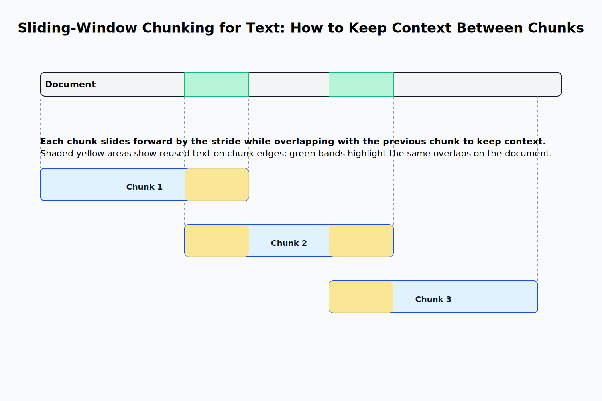

# Retrieval Augmented Generation

## The RAG Architecture

In the first chapter, we have discussed a few problems LLMs have with hallucinations.
One way to address this is to use a technique called **retrieval-augmented generation** (RAG).

The idea is straightforward: rather than directly generating a response, we first retrieve relevant information from a knowledge base and then use it to construct the response.
Such an approach is especially useful if we are working with domain-specific data that regular Large Language Models (LLMs) are not trained on.

The simplest way to implement this is to find the most relevant pieces of information in a knowledge base by performing an embedding-based similarity search.
Then, we add those documents to the prompt and generate a response.

Let's look at an example.

Consider the following documents about a fictitious company called "Example Corp" along with a few other pieces of information about countries and their capitals:

```python
documents = [
    "Example Corp was founded in 2020",
    "The capital of France is Paris",
    "Example Corp is a technology company that develops AI solutions",
    "The capital of Germany is Berlin",
    "Example Corp is headquartered in San Francisco",
    "The capital of Spain is Madrid",
    "The CEO of Example Corp is John Doe",
    "The capital of Italy is Rome",
]
```

Now, let's say that the user would like to know something about Example Corp:

```python
user_query = "Who is the CEO of Example Corp?"
```

To answer this question, we first need to retrieve the most relevant documents from the knowledge base.
We can do this by embedding the user query and the documents and then performing a similarity search like we did in the previous chapter.

We already know how to generate an embedding for a string:

```python
import os, requests

def generate_embedding(text):
    response = requests.post(
        "https://api.openai.com/v1/embeddings",
        headers={
            "Authorization": f"Bearer {os.getenv('OPENAI_API_KEY')}",
            "Content-Type": "application/json",
        },
        json={
            "input": text,
            "model": "text-embedding-3-small"
        }
    )

    response_json = response.json()
    embedding = response_json["data"][0]["embedding"]
    return embedding
```

We can use the `generate_embedding` function to embed the documents and the user query:

```python
document_embeddings = [generate_embedding(doc) for doc in documents]
user_query_embedding = generate_embedding(user_query)
```

We can now perform a similarity search to find the most relevant documents.
Since OpenAI embeddings are normalized, we can just use the dot product to compute the similarity between the query embedding and the document embeddings.
Then, it's just a matter of picking the top-k documents with the highest similarity to the query:

```python
def get_dot_product(v, w):
    return sum(v_i * w_i for v_i, w_i in zip(v, w))

def get_most_similar_documents(query_embedding, document_embeddings, documents, top_k=5):
    similarities = [get_dot_product(query_embedding, doc_embedding) for doc_embedding in document_embeddings]
    most_similar_indices = sorted(range(len(similarities)), key=lambda i: similarities[i], reverse=True)[:top_k]
    return [(documents[i], similarities[i]) for i in most_similar_indices]
```

Now, we can use this function to retrieve the most relevant documents:

```python
most_similar_documents = get_most_similar_documents(user_query_embedding, document_embeddings, documents)
for doc, similarity in most_similar_documents:
    print(f"Document: {doc}, Similarity: {round(similarity, 2)}")
```

This outputs the following:

```python
Document: The CEO of Example Corp is John Doe, Similarity: 0.86
Document: Example Corp was founded in 2020, Similarity: 0.5
Document: Example Corp is headquartered in San Francisco, Similarity: 0.5
Document: Example Corp is a technology company that develops AI solutions, Similarity: 0.47
Document: The capital of France is Paris, Similarity: 0.06
```

The document with the highest similarity is the one that contains the exact information we are looking for—the CEO of Example Corp.
This is followed by three documents that contain general information about Example Corp, though not the specific detail we're looking for. While still relevant, their similarity scores are noticeably lower.
The last document contains information about the capital of France which is completely irrelevant to our query and so the similarity to the query is close to 0.

Now, we can use these documents to generate a response.
We do this by constructing a prompt that includes the user query and the most relevant documents:

```python
def generate_response(user_query, most_similar_documents):
    prompt = f"""
    Answer the user query based on the following documents:
    {"\n".join(most_similar_documents)}

    User query: {user_query}
    """

    response = requests.post(
        "https://api.openai.com/v1/chat/completions",
        headers={
            "Authorization": f"Bearer {os.getenv('OPENAI_API_KEY')}",
            "Content-Type": "application/json",
        },
        json={
            "model": "gpt-4o",
            "messages": [{"role": "user", "content": prompt}],
        },
    )

    response_json = response.json()
    return response_json["choices"][0]["message"]["content"]
```

Let's now use this function to actually generate a response:

```python
response = generate_response(user_query, [doc[0] for doc in most_similar_documents])
print(response)
```

This will return something along the lines of:

```
The CEO of Example Corp is John Doe.
```

This is the correct answer.

To recap, RAG consists of two steps:

1. **Retrieval**—Given a user query, find the most relevant documents in a knowledge base.
2. **Generation**—Use the retrieved documents to generate a response.

While the core concept behind RAG is relatively simple, applying it in real-world scenarios introduces quite a bit of complexity.
In particular, we often work with large documents that must be broken into smaller segments, or **chunks**, to make them suitable for retrieval.

> Additionally, it is sometimes worth it to use something other than a simple similarity search to retrieve the most relevant documents.
> One example for a more sophisticated retrieval method is called Maximum Marginal Relevance which tries to find a balance between document relevance and diversity.
> This is outside the scope of this book, but you can read more about it in [this Elasticsearch blog post](https://www.elastic.co/search-labs/blog/maximum-marginal-relevance-diversify-results).

## Simple Chunking Strategies

Consider the following document:

```python
document = """
John Doe is the CEO of ExampleCorp.
He's a skilled software engineer with a focus on scalable systems.
In his spare time, he plays guitar and reads science fiction.

ExampleCorp was founded in 2020 and is based in San Francisco.
It builds AI solutions for various industries.
John still finds time for music and books, even with a busy schedule.

The company is a subsidiary of Example Inc, a tech conglomerate.
Example Inc started in 2015 and is headquartered in New York.
ExampleCorp keeps its startup energy despite the parent company.

San Francisco and New York serve as the main hubs.
This supports talent on both coasts.
John's mix of tech and creativity shapes a forward-thinking culture.
"""
```

How could we split this document into digestible chunks?

The simplest way to chunk a document is to use **fixed-size chunking**.
This method is very straightforward: we just split the document into chunks of a fixed size.

Here is how the implementation looks like:

```python
def fixed_size_chunking(document, chunk_size):
    return [document[i:i+chunk_size] for i in range(0, len(document), chunk_size)]

chunks = fixed_size_chunking(document, 100)
```

The issue with this approach is that it will split the document at arbitrary points.
For example, here are the first three chunks of our example document:

```
"\nJohn Doe is the CEO of ExampleCorp.\nHe's a skilled software engineer with a focus on scalable syste"
'ms.\nIn his spare time, he plays guitar and reads science fiction.\n\nExampleCorp was founded in 2020 a'
'nd is based in San Francisco.\nIt builds AI solutions for various industries.\nJohn still finds time f'
```

Note how the word "systems" is split between the first and second chunk.
With longer documents, this will become a big problem as we will split context between chunks and lose important information.

A straightforward improvement to fixed-size chunking is **sliding window chunking** where each new chunk slides forward while retaining some overlap with the previous chunk.
This allows us to retain some context between the chunks.



Here is how the implementation looks like:

```python
def sliding_window_chunking(document, chunk_size, overlap):
    chunks = []
    for i in range(0, len(document), chunk_size - overlap):
        chunks.append(document[i:i+chunk_size])
    return chunks

chunks = sliding_window_chunking(document, 100, 20)
```

Here are the first three chunks:

```
"\nJohn Doe is the CEO of ExampleCorp.\nHe's a skilled software engineer with a focus on scalable syste"
'us on scalable systems.\nIn his spare time, he plays guitar and reads science fiction.\n\nExampleCorp w'
'tion.\n\nExampleCorp was founded in 2020 and is based in San Francisco.\nIt builds AI solutions for var'
```

This is slightly better, but still not great.

The problem with both of these approaches is that they are not aware of the content of the document.
They will always split the document at the same place regardless of the actual document structure.

A more sophisticated approach is to use **recursive chunking** where we define a hierarchy of separators like the following:

- Paragraphs (split by `\n\n`)
- Sentences (split by `.`)
- Sentence parts (split by `,`)

We can then use this hierarchy to recursively split the document into smaller chunks where we first split by the coarsest separator and then move to the finer ones until the chunks are below a certain size.

Here is how the function signature would look like:

```python
def recursive_chunking(text, separators, max_len):
    ...
```

How could we implement this?
First, we would need to define the base case—if the text is already short enough, or there no more separators left, we just return the current text as a chunk:

```python
if len(text) <= max_len or not separators:
    return [text]
```

Assuming the base case is not met, we proceed with the recursive case by selecting the first (i.e., highest-priority) separator and splitting the text accordingly:

```python
sep = separators[0]
parts = text.split(sep)
```

Now, that we have a list of parts, we can iterate over each part and check whether it is still too long.
If that is the case, then we should recursively chunk the part again with the remaining separators—otherwise, we can just add the part to the list of chunks.
We also need to make sure that we skip empty parts.

This approach follows a classic recursive structure and can be implemented as follows:

```python
for part in parts:
    if not part.strip():
        continue  # Skip empty parts

    # If still too long, recurse with other separators
    if len(part) > max_len and len(separators) > 1:
        chunks.extend(recursive_chunking(part, separators[1:], max_len))
    # Otherwise, we can just add the part to the list of chunks
    else:
        chunks.append(part)
```

Finally, we need to return the list of chunks from the recursive function.

Here is how the entire function implementation looks like:

```python
def recursive_chunking(text, separators, max_len):
    if len(text) <= max_len or not separators:
        return [text]

    sep = separators[0]
    parts = text.split(sep)

    chunks = []
    for part in parts:
        if not part.strip():
            continue  # Skip empty parts

        # If still too long, recurse with other separators
        if len(part) > max_len and len(separators) > 1:
            chunks.extend(recursive_chunking(part, separators[1:], max_len))
        else:
            chunks.append(part)

    return chunks

chunks = recursive_chunking(document, ['\n\n', '.', ','], 100)
```

Here are the first three chunks:

```
'\nJohn Doe is the CEO of ExampleCorp'
"\nHe's a skilled software engineer with a focus on scalable systems"
'\nIn his spare time, he plays guitar and reads science fiction'
```

Much better.

You hierarchy of separators will of course depend on your specific needs.

Generally speaking, it is often useful to take document structure into account when performing chunking, especially when working with structured document formats such as Markdown or HTML.

Consider the following Markdown document:

```
# A Markdown Document

## Introduction

This is the introduction of the document.

## Background

This is the background section of the document.

## Conclusion

This is the conclusion of the document.
```

Here, we would not even need to implement recursive chunking as we can just use the headers to split the document into sections:

```python
def markdown_chunking(document):
    return document.split("\n\n##")

chunks = markdown_chunking(document)
```

A real implementation would potentially be slightly more complex and might account for headings of different levels, code blocks, and other constructs.
Additionally, combining Markdown chunking with recursive chunking can produce more granular chunks.
Nevertheless, chunking doesn't have to be extremely sophisticated to be effective, especially if we are working with well-structured document formats.

However, sometimes, structure alone is not enough.
While simple chunking methods recognize the document's syntax, they cannot capture its meaning which becomes a problem for unstructured documents.
Luckily, we just learned an excellent tool to capture the semantics of text—embeddings.

## Semantic Chunking

Instead of splitting the document by specific characters, we can segment it at points where the semantic meaning changes.

The simplest way to perform **semantic chunking** is to compute embeddings for all sentences in the document, and then split the document at points where the embedding similarity between one sentence and the next falls below a certain threshold.

To implement semantic chunking, we first need a function that computes the embedding similarity between two sentences.
We will again just use the dot product for this purpose because the OpenAI embeddings are expected to be normalized:

```python
def dot_product(embedding1, embedding2):
    return sum(x * y for x, y in zip(embedding1, embedding2))
```

Now, we can implement the semantic chunking function.

First, we split the document into sentences:

```python
def get_sentences(document):
    return [s.strip() for s in document.split(".") if s.strip()]

sentences = get_sentences(document)
```

> This implementation is rather naive and does not take constructs like abbreviations into account.
> We will ignore this for now for the sake of simplicity.

Next, we precompute the embeddings for all sentences:

```python
embeddings = [generate_embedding(sentence) for sentence in sentences]
```

This is needed to avoid recomputing the embeddings for the same sentence multiple times when we calculate embedding similarities.

Now, we can iterate over the sentences:

```python
chunks = []
for i in range(len(sentences)):
    # Always add the first sentence as a chunk
    if i == 0:
        chunks.append(sentences[i])
    else:
        ...
```

In every iteration except the first, we compute the embedding similarity between the current and previous sentence.
If the similarity is above a certain threshold, we add the sentence to the current chunk—otherwise, we start a new chunk:

```python
embedding_similarity = dot_product(embeddings[i - 1], embeddings[i])
if embedding_similarity < threshold:
    chunks.append(sentences[i])
else:
    chunks[-1] += ". " + sentences[i]
```

Here is how the full implementation looks like:

```python
def semantic_chunking(document, threshold):
    sentences = get_sentences(document)

    embeddings = [generate_embedding(sentence) for sentence in sentences]

    chunks = []
    for i in range(len(sentences)):
        if i == 0:
            chunks.append(sentences[i])
        else:
            embedding_similarity = dot_product(
                embeddings[i - 1], embeddings[i]
            )
            if embedding_similarity < threshold:
                chunks.append(sentences[i])
            else:
                chunks[-1] += ". " + sentences[i]
    return chunks

chunks = semantic_chunking(document, 0.3)
for chunk in chunks:
    print(repr(chunk))
```

This outputs the following:

```
'John Doe is the CEO of ExampleCorp'
"He's a skilled software engineer with a focus on scalable systems. In his spare time, he plays guitar and reads science fiction"
'ExampleCorp was founded in 2020 and is based in San Francisco'
'It builds AI solutions for various industries'
'John still finds time for music and books, even with a busy schedule'
'The company is a subsidiary of Example Inc, a tech conglomerate. Example Inc started in 2015 and is headquartered in New York. ExampleCorp keeps its startup energy despite the parent company'
...
```

This implementation is an oversimplification of semantic chunking.
Usually, the threshold will be dynamic—for example, we might where similarity is in the bottom 5% of all similarities.
Most semantic chunking algorithms will also enforce a minimum and a maximum chunk size to avoid generating too short or too long chunks.
We can also use context windows containing multiple sentences instead of single sentences.

Additionally, the rule of when to add a chunk boundary is often more complex than the one we used in the example above.
For example, the [max-min semantic chunking algorithm](https://link.springer.com/article/10.1007/s10791-025-09638-7) tries to approach chunking as a temporal clustering problem, i.e. a clustering problem where we want to keep the ordering intact.

The core idea is similar to our naive algorithm:
We process the document sentence by sentence and for each sentence we decide whether to add it to the current chunk or to start a new one.

To make this decision, we look at two things.

First, the "internal cohesion" of the chunk is computed as the minimum pairwise embedding similarity between all sentences in the current chunk:

$$
\text{min\_sim}(C) = \min_{s_i, s_j \in C} \text{sim}(s_i, s_j)
$$

Next, the "closeness" of the new sentence to the chunk is computed as the maximum similarity between any sentence in the current chunk and the sentence we are currently processing:

$$
\text{max\_sim}(C, s) = \max_{s_i \in C} \text{sim}(s_i, s)
$$

We then add the sentence if the closeness is greater than the internal cohesion—that is, if the sentence is more similar to the chunk than the sentences in the chunk are to one another:

$$
\text{max\_sim}(C, s) > \text{min\_sim}(C)
$$

If that is not the case, we start a new chunk.

Let's implement this in code.

First, we need to implement the function that computes the internal cohesion of a chunk.
We must handle the case where the chunk contains only one sentence separately, for example by returning a predefined default value.

```python
def get_min_sim(chunk_embeddings):
    if len(chunk_embeddings) == 1:
        return 0.3

    min_sim = float("inf")
    for i in range(len(chunk_embeddings)):
        for j in range(i + 1, len(chunk_embeddings)):
            sim = dot_product(chunk_embeddings[i], chunk_embeddings[j])
            min_sim = min(min_sim, sim)
    return min_sim
```

Next, we need to implement the function that computes the closeness of a sentence to a chunk:

```python
def get_max_sim(chunk_embeddings, sentence_embedding):
    max_sim = float("-inf")
    for chunk_embedding in chunk_embeddings:
        sim = dot_product(sentence_embedding, chunk_embedding)
        max_sim = max(max_sim, sim)
    return max_sim
```

Now, we can implement the semantic chunking function.
First, we need to get the sentences and their embeddings and initialize the current chunk and the current chunk embeddings:

```python
sentences = get_sentences(document)
embeddings = [generate_embedding(sentence) for sentence in sentences]

chunks = []
current_chunk = sentences[:1]
current_chunk_embeddings = embeddings[:1]
```

We then iterate over the sentences:

```python
for i in range(1, len(sentences)):
    ...
```

At every iteration we compute the internal cohesion and the closeness of the current sentence to the current chunk:

```python
sentence = sentences[i]
sentence_embedding = embeddings[i]
min_sim = get_min_sim(current_chunk_embeddings)
max_sim = get_max_sim(current_chunk_embeddings, sentence_embedding)
```

Then we make the decision whether to add the sentence to the current chunk or to start a new one:

```python
if max_sim > min_sim:
    current_chunk.append(sentence)
    current_chunk_embeddings.append(sentence_embedding)
else:
    # Start new chunk
    chunks.append(". ".join(current_chunk))
    current_chunk = [sentence]
    current_chunk_embeddings = [sentence_embedding]
```

Finally, we need to add the last chunk outside of the loop:

```python
if current_chunk:
    chunks.append(". ".join(current_chunk))
```

This is the complete implementation:

```python
def max_min_semantic_chunking(document):
    sentences = get_sentences(document)
    embeddings = [generate_embedding(sentence) for sentence in sentences]

    chunks = []
    current_chunk = sentences[:1]
    current_chunk_embeddings = embeddings[:1]

    for i in range(1, len(sentences)):
        sentence = sentences[i]
        sentence_embedding = embeddings[i]
        min_sim = get_min_sim(current_chunk_embeddings)
        max_sim = get_max_sim(current_chunk_embeddings, sentence_embedding)

        if max_sim > min_sim:
            current_chunk.append(sentence)
            current_chunk_embeddings.append(sentence_embedding)
        else:
            chunks.append(". ".join(current_chunk))
            current_chunk = [sentence]
            current_chunk_embeddings = [sentence_embedding]

    if current_chunk:
        chunks.append(". ".join(current_chunk))

    return chunks


print("\nMax-min semantic chunking:")
chunks = max_min_semantic_chunking(document)
for chunk in chunks:
    print(repr(chunk))
```

Our output will be similar to the following:

```
'John Doe is the CEO of ExampleCorp'
"He's a skilled software engineer with a focus on scalable systems. In his spare time, he plays guitar and reads science fiction"
'ExampleCorp was founded in 2020 and is based in San Francisco'
'It builds AI solutions for various industries'
'John still finds time for music and books, even with a busy schedule'
'The company is a subsidiary of Example Inc, a tech conglomerate. Example Inc started in 2015 and is headquartered in New York'
...
```

Again, when implementing this for real documents, the technical details are slightly more complex.
Most importantly, when the size of the current chunk is small, the closeness should be allowed to be lower than the internal cohesion.
To account for this, we can use a multiplier on the closeness value which scales with the size of the chunk resulting in a dynamic threshold.
Additionally, you need to be careful with the internal cohesion of a chunk of size 1.
Instead of setting it to a fixed value, it is a good idea to consider the chunk and the next sentence together.

Semantic methods can perform better than simple chunking methods especially for poorly structured documents.
However, they are not a silver bullet.
If we are dealing with a well-structured document, simple chunking methods can often be more effective.

We must also keep in mind that semantic chunking requires computing embeddings for each sentence or sentence window in every document, which can make it unsuitable for certain applications.

Therefore, in real applications, you need to weigh the benefits of semantic chunking against the cost instead of implementing the fanciest method you know to show-off your skills.

## Contextualizing Chunks

Apart from changing the chunking strategy, we can also improve performance by contextualizing the chunks.
This can improve the retrieval process as the LLM now has more information to generate a response.

For example, consider the following chunk from a document about Example Corp's performance in Q2 2023:

```
The company's revenue grew by 3% over the previous quarter.
```

On its own, this statement is ambiguous.
It doesn't specify which company we're talking about, or which quarter the data refers to.
If a user queries the knowledge base for "Example Corp Q2 2023 revenue growth," this chunk is unlikely to surface despite the fact that it contains relevant information.

By adding the missing context, retrieval can become much more effective.

One straightforward way to add context is to prepend a generic document summary to every chunk, for example:

```
Document summary:
This document is the SEC filing on Example Corp's performance in Q2 2023.

Chunk:
The company's revenue grew by 3% over the previous quarter.
```

This is easy to implement and results in every chunk being contextually enriched.

However, the problem with this approach is that this will increase the size of all the chunks and also add a lot of noise.
If you embed the combined text (chunk + summary), the embedding will more likely reflect the general document summary than the specific content of the chunk.
You are essentially repeating broad context across the entire embedding space.

With the above approach, every chunk— whether it's about quarterly revenue, hiring plans, or something else entirely—will contain the phrase "This document is the SEC filing on Example Corp's performance in Q2 2023".
While this helps ensure that a search for Example Corp and Q2 2023 won't miss the relevant chunks, it can also cause irrelevant matches.

Consider an example scenario where you are searching for "Example Corp's executive bonuses in Q2 2023".
The most relevant chunk will probably the one that explicitly mentions those bonuses.
However, because every chunk contains the same general document summary, chunks about unrelated topics may score highly simply because of the generic context.

In short, while this method guarantees that every chunk is tied to the document, it also introduces a lot of noise, potentially reducing retrieval performance.

The **Document Summary Index** approach outlined in [A New Document Summary Index for LLM-powered QA Systems](https://www.llamaindex.ai/blog/a-new-document-summary-index-for-llm-powered-qa-systems-9a32ece2f9ec) tries to mitigate this problem by storing document summaries separately.

Here is how it works:

1. Generate an unstructured text summary for each document.
2. Perform chunking as usual.
3. For every chunk, store a mapping to the document summary.
4. During retrieval, first retrieve the best-matching documents by searching the document summaries.
   Then, search only for the chunks that belong to the retrieved documents.

The chunks are kept small and focused, while still using document-level context to improve retrieval.
This reduces irrelevant matches from generic document summaries.

The trade-off is that you will miss relevant chunks in documents whose summaries don't seem related to the query but contain useful details in isolated sections.
Additionally, this requires two searches: one for the document summaries and one for the chunks.

Yet another approach is **Hypothetical Document Embeddings** (HyDE for short) outlined in the paper [Precise Zero-Shot Dense Retrieval without Relevance Labels](https://arxiv.org/abs/2212.10496) which takes a different angle altogether:

Given a query, the LLM generates a hypothetical document that is likely relevant to the query, essentially a synthetic "good answer".
We then embed this hypothetical document and perform retrieval by finding the nearest neighbors of the hypothetical document embedding instead of the query embedding.

This technique works well when your corpus contains text similar in style or structure to the imagined document, since it places the search directly into the "semantic neighborhood" where relevant answers live.
However, it might fail if the general style differs too much from the actual corpus.

Additionally, HyDE requires a query-time LLM generation of the hypothetical document which can be quite costly at scale.
Therefore, this method is rarely used in practice unless you have a very specific use case.

The most promising approach is outlined in the Anthropic paper [Contextual Retrieval](https://www.anthropic.com/news/contextual-retrieval).
Here, the authors evaluated the above methods and found them lacking for most practical use cases.

Instead, they proposed to postprocess every chunk by adding the document or a document summary and asking an LLM to generate a contextualized chunk.

Here is an example prompt to accomplish this:

```
<document>
{{WHOLE_DOCUMENT}}
</document>
Here is the chunk we want to situate within the whole document
<chunk>
{{CHUNK_CONTENT}}
</chunk>
Please give a short succinct context to situate this chunk within the overall document for the purposes of improving search retrieval of the chunk. Answer only with the succinct context and nothing else.
```

This could result in a contextualized chunk like the following:

```
This chunk is from an SEC filing on Example Corp's performance in Q2 2023; the previous quarter's revenue was $314 million. The company's revenue grew by 3% over the previous quarter.
```

This contextualized version retains the original detail but supplements it with just enough extra information to make retrieval more precise.

Why is this method useful?

Compared to simply prepending a document summary, contextual retrieval avoids blindly embedding the same generic context into every chunk.
Instead, content can be customized to the specific chunk, which makes the chunks more specific and reduces the risk of irrelevant matches.

Compared to the Document Summary Index, contextual retrieval doesn't risk missing relevant chunks because a document summary doesn't mention a specific detail we care about.
Additionally, it doesn't require a two-step retrieval process.

Compared to HyDE, contextual retrieval doesn't rely on query-time LLM generation.
Instead, we need to contextualize the chunks once and then store the contextualized chunks.
There is no performance penalty at query time.

The main drawback of contextual retrieval is the high cost of document chunking, as every chunk must be postprocessed by an LLM, which can become problematic at scale.
However, for many applications, a higher cost at document ingestion time is a worthwhile trade-off for the performance gains at query time.
Additionally, with some model providers, you can cut down on the cost by using a technique called **prompt caching** where you can load the document into the cache once and then keep referencing the previously cached content.

> You can learn more about prompt caching [here](https://platform.openai.com/docs/guides/prompt-caching) and [here](https://docs.anthropic.com/en/docs/build-with-claude/prompt-caching).

While contextual chunking tends to perform better than other methods, choosing the right approach will still depend on your use case.
It's especially important to evaluate the performance of your retrieval system before and after contextualization and only apply it if it's worth the additional cost.

Finally, contextualization is usually combined with other retrieval strategies.
For example, here is a full pipeline suggested by the authors of the [Contextual Retrieval](https://www.anthropic.com/news/contextual-retrieval) paper:

1. Break down each document into chunks.
2. For each chunk, contextualize it using an LLM to generate contextualized chunks.
3. Create semantic embeddings (and TF-IDF encodings) of those chunks.
4. Use the BM25 algorithm to retrieve the most relevant chunks for a given query.
5. Use embeddings to retrieve the most relevant chunks based on semantic similarity.
6. Combine and deduplicate the results using rank fusion.
7. Add the top-k final chunks to the prompt and generate a response.

This pipeline is a good fit for most practical use cases and tends to perform well in practice.
